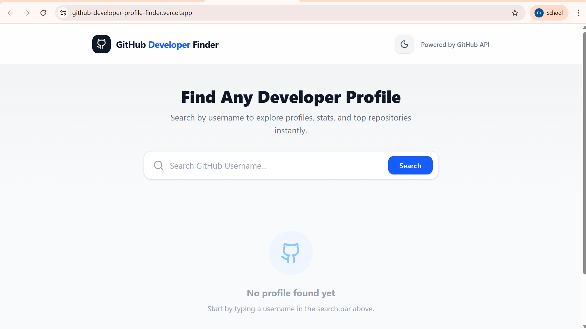
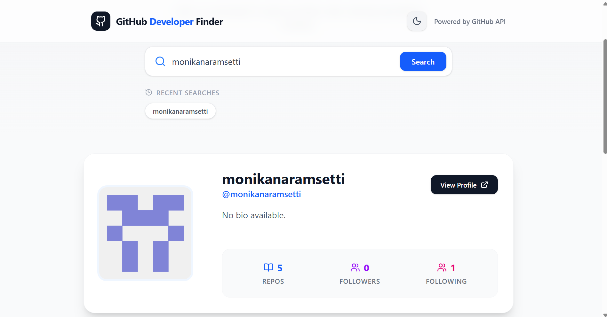
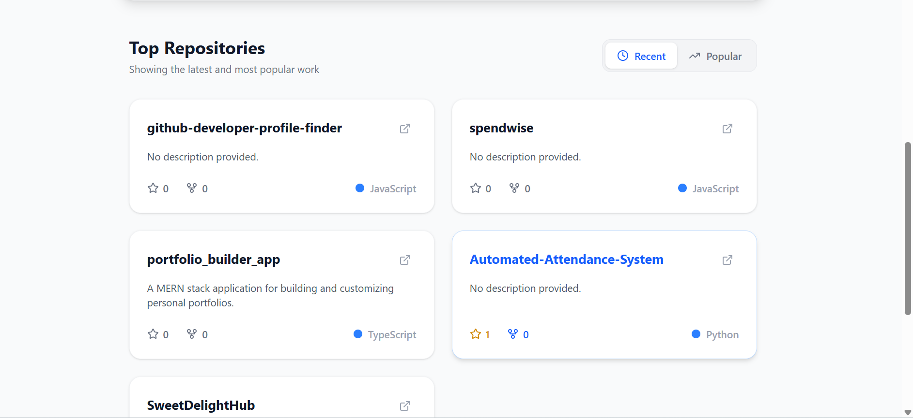
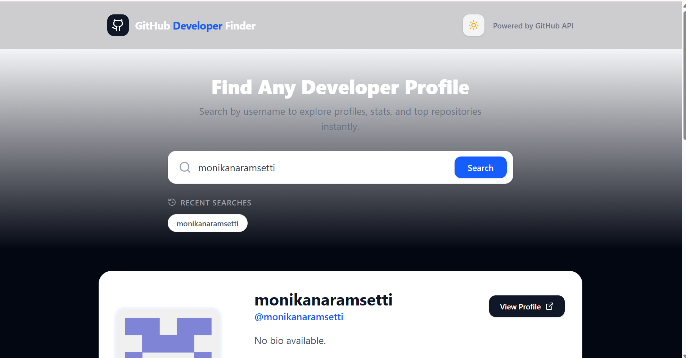

# 🔍 GitHub Developer Profile Finder

A modern, high-performance **React application** that allows users to search for GitHub developers and explore their profiles, statistics, and repositories using the **GitHub REST API**.

The application features a **premium UI, dark mode support, repository sorting, and persistent search history**, making it a complete frontend engineering project.

---

## 🚀 Live Demo

🌐 **Deployed Application:**
https://github-developer-profile-finder.vercel.app

📂 **GitHub Repository:**
https://github.com/monikanaramsetti/github-developer-profile-finder

---

## 📸 Application Screenshots

### 🔎 Search Interface



### 👤 Developer Profile



### 📂 Repository Grid



### 🌙 Dark Mode



---

## ✨ Key Features

* 🔎 **Live GitHub Search**
  Instantly search GitHub developers using the **GitHub REST API**.

* 👤 **Developer Profile Display**
  Shows avatar, bio, location, and key statistics including repositories, followers, and following.

* 📂 **Repository Grid with Sorting**
  View repositories and sort by:

  * ⭐ Most Stars (Popularity)
  * 🕒 Last Updated (Recent)

* 🌙 **Dark Mode Support**
  Toggle between light and dark themes for a premium UI experience.

* 🕒 **Recent Search History**
  Stores the last **5 searched usernames** using **localStorage**.

* 📱 **Fully Responsive UI**
  Optimized layouts for **mobile, tablet, and desktop**.

* ⚡ **Smooth UX Enhancements**

  * Loading spinner while fetching API data
  * Error handling for invalid usernames
  * Graceful fallback when API rate limits occur

---

## 🛠️ Tech Stack

**Frontend**

* React (Vite)
* JavaScript (ES6+)
* Tailwind CSS

**Libraries**

* Axios – API requests
* Lucide React – icons

**API**

* GitHub REST API

---

## 📂 Project Structure

src/
components/
SearchBar.jsx
ProfileCard.jsx
RepoList.jsx
RepoCard.jsx

App.jsx
main.jsx

---

## ⚙️ Getting Started

### Prerequisites

* Node.js (v18 or later)
* npm

### Installation

Clone the repository

```bash
git clone https://github.com/monikanaramsetti/github-developer-profile-finder.git
```

Navigate to the project directory

```bash
cd github-developer-profile-finder
```

Install dependencies

```bash
npm install
```

Start the development server

```bash
npm run dev
```

The application will run at:

http://localhost:5173

---

## 🌍 Deployment

The application is deployed on **Vercel**.

Live URL:
https://github-developer-profile-finder.vercel.app

Vercel automatically redeploys the project whenever new commits are pushed to GitHub.

---

## 📄 License

Distributed under the **MIT License**.

---

## 👩‍💻 Author

**Naramsetti Monika**

GitHub
https://github.com/monikanaramsetti

LinkedIn
https://linkedin.com/in/naramsetti-monika

---

⭐ If you like this project, consider giving it a star!
